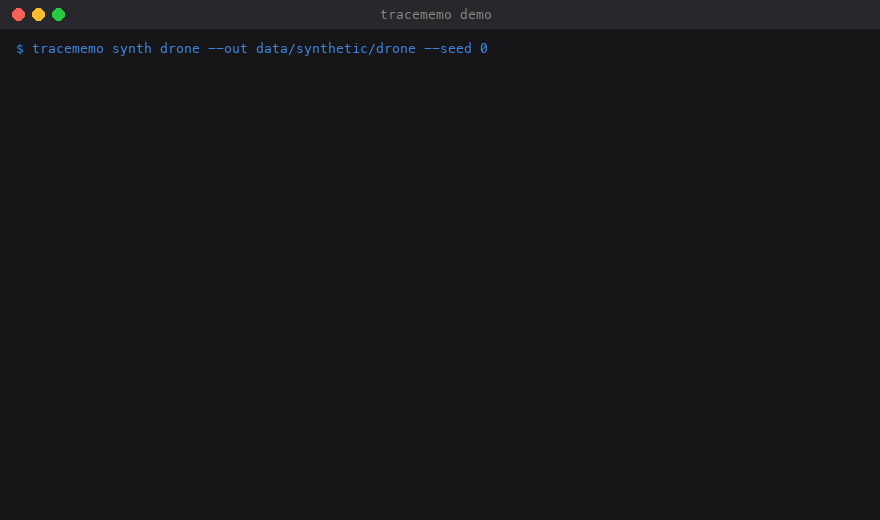
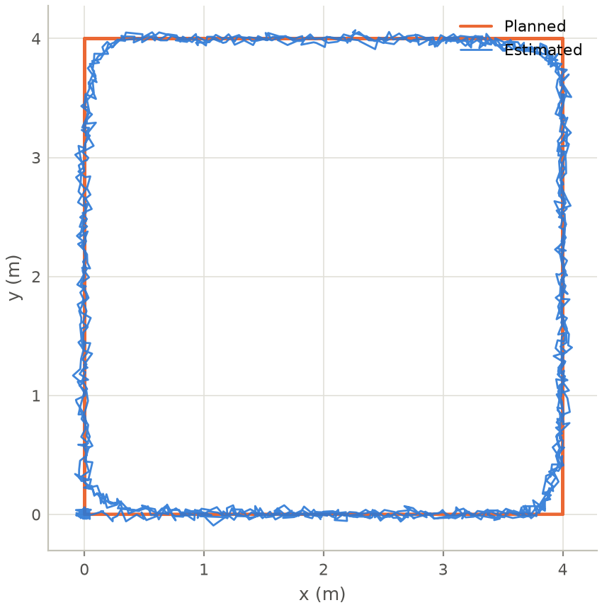
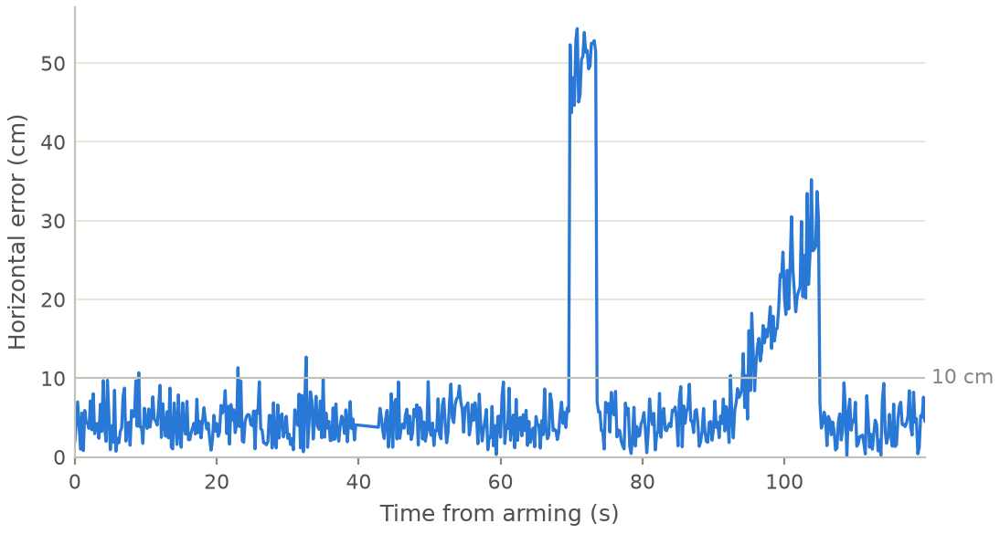
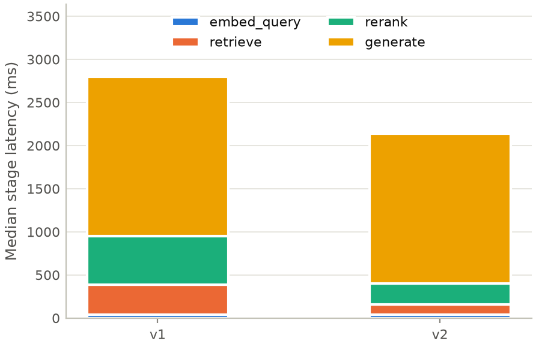

# tracememo

Turn raw experiment output into the analysis, figures, tables and first-draft prose of a
technical report, where **every number in the document is linked to the code and data that
produced it**. See `SPEC.md` for the full design.



**Live numbers.** A number in the report is never typed as text. It is a reference to a
computed value: `{{ val("drone.loc_err.mean_cm") }}` in Markdown, `\val{drone.loc_err.mean_cm}`
in LaTeX. Rerun the pipeline and every number, table and figure updates together.

**Three guarantees.** *Provenance:* every value, figure and table records the input files (by
content hash), the analysis code (by source hash), the parameters and the git commit that
produced it. *Consistency:* the document's numbers come only from the value store.
*Grounding:* LLM-drafted prose is checked, and any number or comparison not backed by the
store is flagged.

Status: all eight milestones of `SPEC.md` are implemented. Real NASA data never enters the
repo; everything is demonstrated on synthetic data with known ground truth.

## Architecture

```mermaid
flowchart LR
    RAW[("Raw files<br/>ArduPilot .bin, Marvelmind CSV,<br/>Langfuse JSON, eval CSV")] --> AD[Adapters<br/>tracememo.adapters]
    AD --> TBL[("Normalized Parquet tables<br/>+ input file hashes")]
    TBL --> AN[Analyses<br/>@analysis, dependency order,<br/>cached by source+params+inputs]
    AN --> MAN[("build/manifest.json<br/>values · figures · tables<br/>+ provenance")]
    MAN --> RENDER[Render<br/>Markdown · values.tex/PDF · HTML viewer]
    MAN --> CHECK[Check<br/>raw numbers · unknown ids ·<br/>staleness · comparisons · LLM claims]
    MAN --> DRAFT[Draft<br/>LLM writes {{val:id}} placeholders]
    DRAFT --> TPL[Templates & fragments]
    TPL --> RENDER
    TPL --> CHECK
    SYN[Synthetic generators<br/>drone flight · RAG traces<br/>with truth.json] -.-> RAW
    SYN -.-> EVAL[eval/ scripts]
    MAN -.-> EVAL
```

<p>



</p>

## Quick start

```
python3 -m venv .venv && .venv/bin/pip install -e ".[dev]"
.venv/bin/tracememo synth drone --out data/synthetic/drone --seed 0
.venv/bin/tracememo build --config examples/drone_memo/project.yaml
open examples/drone_memo/build/report.md
.venv/bin/tracememo explain drone.loc_err.mean_cm --config examples/drone_memo/project.yaml
```

Numbers in `examples/drone_memo/report.md.j2` are written as `{{ val("drone.loc_err.mean_cm") }}`
and in `report.tex` as `\val{drone.loc_err.mean_cm}` (or `\valu{...}` with unit,
`\fig{...}`, `\tab{...}`). Both are filled from `build/manifest.json`, which records the
provenance of every value. If `latexmk` is installed, `build` also produces `report.pdf`.
Re-running `build` reruns only analyses whose code, parameters or input data changed.

`examples/drone_memo/project_raw.yaml` runs the same memo from an ArduPilot `.bin` log and a
Marvelmind CSV (synthetic ones are generated alongside the Parquet tables), using the
`ardupilot` and `marvelmind` adapters. The message-to-table mapping is configuration; see the
docstrings in `tracememo/adapters/ardupilot.py` and `marvelmind.py` and `docs/schemas.md`.

The second example, `examples/rag_memo`, covers an LLM pipeline: Langfuse-style trace exports
and per-item evaluation scores go through the `langfuse` and `eval_table` adapters, and the
`llm.latency` and `llm.eval` analyses produce stage/end-to-end latency per version and
bootstrap confidence intervals per metric and configuration:

```
.venv/bin/tracememo synth rag --out data/synthetic/rag --seed 0
.venv/bin/tracememo build --config examples/rag_memo/project.yaml
```

## Drafting with an LLM

```
export ANTHROPIC_API_KEY=...
.venv/bin/tracememo draft --section results --outline outline.md --config examples/drone_memo/project.yaml
.venv/bin/tracememo check --llm --config examples/drone_memo/project.yaml drafts/results.md.j2
```

`draft` gives the model your outline plus the list of available value, figure and table ids
and forbids digits: every quantity must be a `{{val:id}}` placeholder. The result is saved as
a template fragment, so it stays live when the data changes, and is checked immediately; on
errors the findings are sent back once for a corrected draft. `check --llm` additionally asks
the model whether each remaining quantitative sentence is supported by the cited values
(warnings only). The model name comes from `llm.model` in `project.yaml`; prompts live in
`tracememo/draft/prompts/`. Set `TRACEMEMO_FAKE_LLM=responses.json` to dry-run without an API key.

`tracememo viewer` (or `formats: [..., html]`) writes a standalone `report.html` where
clicking any number opens its provenance: analysis, source hash, commit, parameters, input
tables and raw files with hashes.

`tracememo check` (also run at the end of `build`) flags raw numbers typed into prose,
references to ids that are not in the manifest, values whose input files or analysis code
changed since the last run, and two-value comparisons ("A was lower than B") whose direction
contradicts the stored values. It exits non-zero on any error, for use in CI.

## Extending

See [`docs/extending.md`](docs/extending.md) for how to add an adapter, an analysis or a
template, [`docs/schemas.md`](docs/schemas.md) for the normalized table schemas, and
[`DECISIONS.md`](DECISIONS.md) for design choices made where the spec was open.

## Development

```
.venv/bin/ruff check . && .venv/bin/ruff format .
.venv/bin/pytest
.venv/bin/python docs/make_demo_gif.py     # regenerate the README animation
```

CI (GitHub Actions) runs ruff, pytest, builds all three example projects and runs the
deterministic evaluations on Python 3.11 and 3.12.

## Evaluation

`python eval/run_all.py` reproduces the numbers in [`eval/RESULTS.md`](eval/RESULTS.md)
(details in [`eval/README.md`](eval/README.md)). Latest run on synthetic data, seed 0:

| Experiment | Result |
|---|---|
| Reproduction: computed values vs. ground truth | 97 of 97 values within tolerance (max relative error 0 for normalized tables, 0.5% via the ArduPilot/Marvelmind adapters, 4e-6 for the RAG example) |
| Checker recall on injected errors (100 per type) | swapped number 100%, invented statistic 100%, flipped comparison 100%, unknown reference 100%, stale value 100% |
| Checker false positives on clean drafts | 0 of 100 documents |
| Staleness demo: perturb the beacon log | `drone.loc_err` and `drone.failures` reran, `drone.trajectory` served from cache; 12 values changed, 13 unchanged |
| Drafting grounding rate (placeholders vs. free-form) | needs `ANTHROPIC_API_KEY`: `python eval/drafting.py --n 20` |
